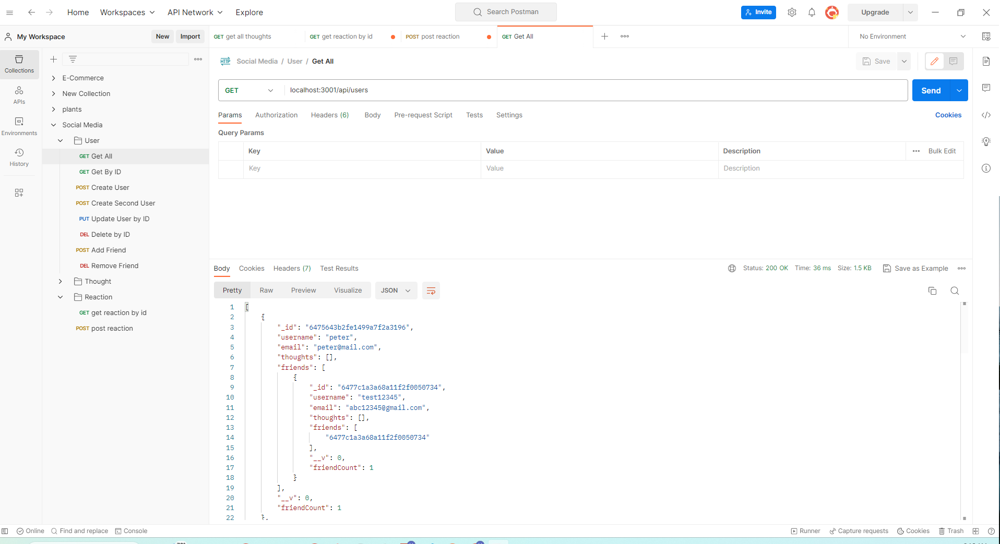
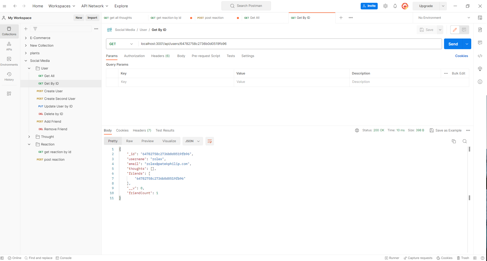
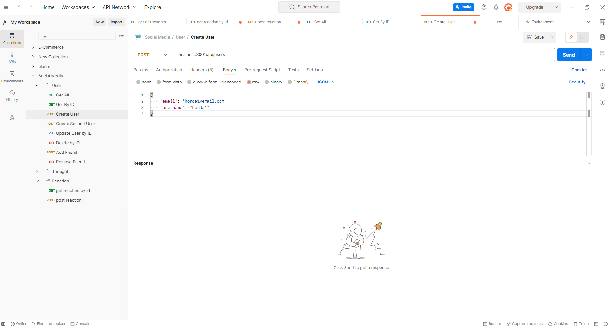
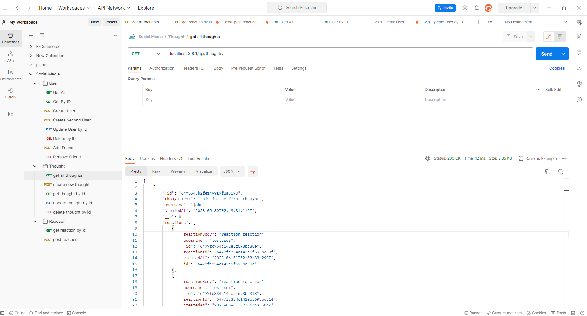
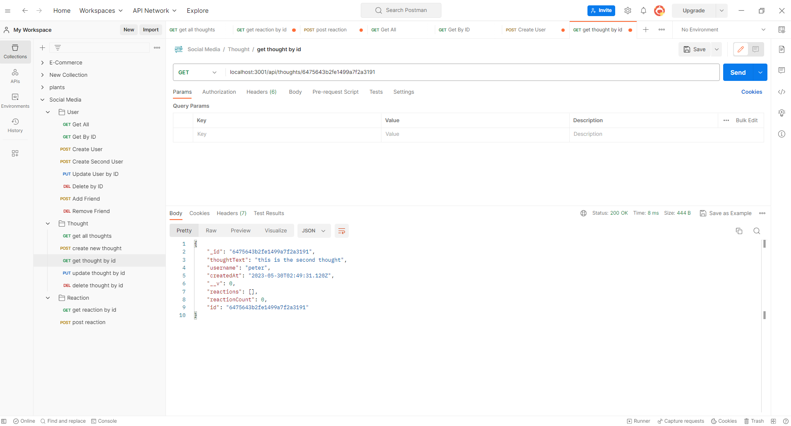
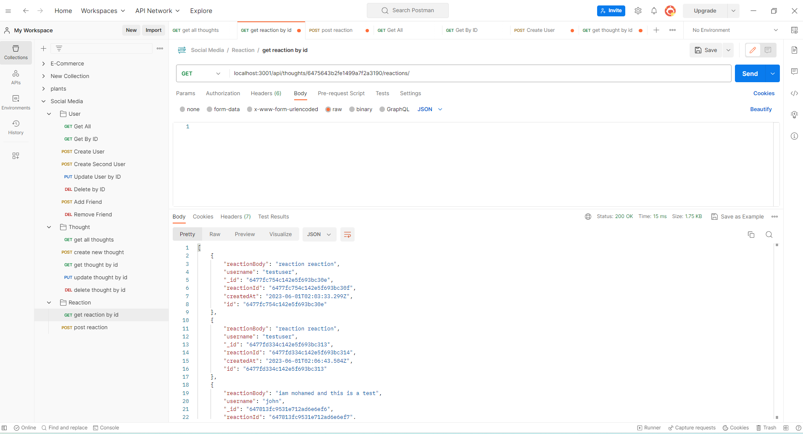

# NoSQL-social-network-API

## Discription

this is my 18th assignment and it was creating a backend NoSQL social network using , mongoDB, mongoose,

in this 18th assignment  i started my own code 

-my motivation was to practice what i learned in the bootcamp untill Jun 1nd 2023

-the problem i experinced is creating the schemas,to link reactions to thought, and rendering the reactions only when i want to get reaction by id,

## usage
the application is only a backend made from Mongo and mongoose,it has been pushed to github repostiry.

## github 
https://github.com/melhelow/NoSQL-social-network-API

## screencastify
https://drive.google.com/file/d/1YSOtCnN23NAONrpFsgXVPRwJXe-FmfeV/view

## credits

bootcamp,tutor session,ASKBcs,Theo ward

## License

please refer to the MIT license in the repo